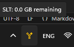

#  SLT Data Monitor

A lightweight system tray application for monitoring SLT (Sri Lanka Telecom) broadband data usage. This tool automatically checks your remaining data balance and displays it in the system tray, eliminating the need to log into the SLT portal repeatedly.

## Features

- **Real-time Data Usage Monitoring**: Displays your remaining data in the system tray
- **Automatic Updates**: Fetches data usage every 10 minutes
- **Minimal Resource Usage**: Runs in the background with minimal system impact
- **Secure Credential Storage**: Encrypts your login information using Windows Data Protection API
- **Auto-start Option**: Can be configured to launch automatically at system startup

## Screenshots

## How to Use

1. Download and install the application from the Releases section
2. Right-click the tray icon and select "Settings"
3. Enter your SLT credentials (username, password, and phone number)
4. Optional: Check "Run at Windows startup" to launch automatically when you turn on your computer
5. Click "Save & Test Connection"

The application will immediately test your connection and begin displaying your data usage in the system tray. The data will automatically update every 10 minutes.

## Technical Details

### Built With
- C# and .NET Framework
- Windows Forms for the minimalist UI
- Windows Registry API for startup functionality
- Windows Data Protection API (DPAPI) for secure credential storage

### How It Works

The application uses the SLT API to fetch data usage information:

1. Authenticates with SLT's API using your credentials
2. Retrieves your current data usage information
3. Extracts the remaining data allocation and displays it in the system tray
4. Repeats this process every 10 minutes to keep the information current

Your credentials are stored locally in an encrypted format using Windows DPAPI, ensuring they cannot be easily accessed by malicious applications.

## Installation

### Prerequisites
- Windows 7 or higher
- .NET Framework 4.6 or higher

### Steps
1. Download the latest release from the [Releases](https://github.com/yourusername/slt-monitor/releases) page
2. Extract the ZIP file to a location of your choice
3. Run `SLTMonitor.exe`
4. Configure your settings

## Development

### Building from Source
1. Clone this repository
2. Open the solution in Visual Studio
3. Build the solution (Ctrl+Shift+B)
4. Run the application (F5)

## License

This project is licensed under the MIT License - see the LICENSE file for details.

## Acknowledgements

- SLT for providing the API (though unofficial)
- Icons made by [Freepik](https://www.freepik.com) from [www.flaticon.com](https://www.flaticon.com/)

---
